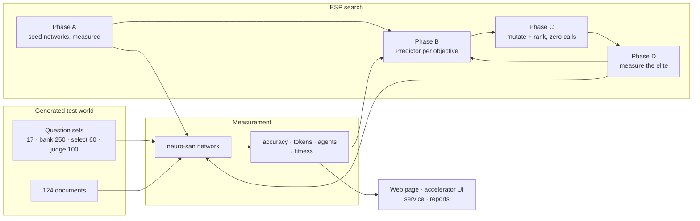

# neuro-san-esp

**A fitness function for [neuro-san](https://github.com/cognizant-ai-lab/neuro-san) agent
networks, and an evolutionary search that uses it.**

[](https://github.com/Sivakumarraj/neuro-san-esp/actions/workflows/ci.yml)
[](pyproject.toml)
[](LICENSE)

neuro-san turns a sentence into a working multi-agent network: `agent_network_designer`
generates one, validates it and serves it. It generates **one**, and never measures it.
Nothing in neuro-san scores one network against another, so there is no way to say whether a
nine-agent topology beats a five-agent one for the same job, or which model each agent should
run.

This project supplies that missing half. It **measures** a network (accuracy, token cost and
size over a fixed set of questions) and **searches** for a better one, borrowing the
surrogate-assisted structure of **ESP** (Evolutionary Surrogate-assisted Prescription),
Cognizant AI Lab's method for optimisation where every real evaluation is expensive.

In the [ESP paper](https://arxiv.org/abs/2002.05368) the Prescriptor is itself a learned
model. **There is no learned Prescriptor here**: prescription is seven mutation operators
plus Pareto-front selection, and what is borrowed is the Predictor and the sample-efficiency
argument. In shape this is nearer to **LEAF** (*Evolutionary Neural AutoML for Deep
Learning*, GECCO 2019), which evolves architectures, with agents where LEAF had layers.

## What is included

- **A measurement for any neuro-san network** on any question file you can check the
  answers to: `make measure`, a browser page, or an evaluator agent inside neuro-san.
- **A generated test world**, Meridian Logistics: 24 depots, 40 contracts, 60 incidents in
  124 documents, invented so no model can answer from memory. Every answer is computed from
  the same seed that writes the documents.
- **Four question sets over it**: the original 17 multi-hop questions; a 250-question
  held-out bank; and `meridian-select` (60) and `meridian-judge` (100), harder sets built
  from disjoint halves of the company for the scale-up experiment.
- **The ESP loop**: a seed population measured for real, one Predictor per outcome
  objective, thousands of candidates ranked for free, and only the most promising paid for.
- **A same-budget experiment** that runs the search with the Predictor and without it, and
  judges both winners on questions neither was selected on.
- **A service**: an event-invoked optimiser on neuro-san's own periodic scheduler that
  spends what the day's budget allows and stops.
- **A browser front end and neuro-san's accelerator UI**, serving every measured network so
  the same question can be put to the designer's shape and the network that beat it.
- **Deployment**: Docker images installed from a pinned lockfile, a Hugging Face Space
  build, Compose with persistent state, and a `make validate` gate.

## Architecture



Each candidate **is** a neuro-san `agent_network_definition` plus a per-agent model choice,
so every network the search produces runs as an ordinary neuro-san network. Fitness is
**derived** from measured or predicted outcomes by a fixed formula, never learned:

```text
fitness = accuracy − 0.06 · min(tokens / 600000, 1) − 0.02 · (agents / 9)
```

[docs/DESIGN.md](docs/DESIGN.md) explains every part: the genome, the seven operators, the
validity gate, what the Predictor is and is not, and the service.

## Quick start

Python 3.12+. Nothing in this section needs an account, a key, or a network.

```bash
python3.12 -m venv .venv && source .venv/bin/activate
pip install -e ".[dev]"

make validate    # lint, docs, HOCON validator, the full suite, an offline search
make offline     # phases B and C: breed and rank candidates, zero LLM calls
make holdout     # select on half the questions, judge on the other half
```

`make offline` trains the Predictor on the 12 committed measurements in
`tests/fixtures/cache/` and evolves against them.

### With a key

Runs on **Anthropic, OpenAI or Google Gemini**, chosen by which key is present, the way
neuro-san-studio chooses:

```bash
cp .env.example .env      # uncomment your provider's key line; .env is gitignored
make check-key            # asks the provider whether the key works
make smoke                # four questions to the champion, end to end
```

A search needs a measured population first. There are two ways to get one. **They are
alternatives, not steps; run one, not both.**

```bash
make baseline             # A: measure the three seed networks on your provider
```

```bash
python scripts/adopt_measurements.py   # B: adopt the committed Gemini measurements
```

> **If a run ever reports `acc=0.00 tok=0 (cached)`**, an earlier run wrote zeros before the
> key worked. `tok=0` means no model was called. `rm -rf .esp-cache` and run the preflight
> again.

[docs/GUIDE.md](docs/GUIDE.md) covers providers and models, the preflight, what a run costs,
the web page, the accelerator UI, and running the optimiser as a service.

## Results

**Twelve networks measured on real model calls, 17 questions each.** All on
`gemini-3.1-flash-lite`.

| | Accuracy | Tokens | Agents | Fitness |
| --- | --- | --- | --- | --- |
| `seed:designer_shaped` — the shape the designer produces | 0.8235 | 385,280 | 4 | 0.7761 |
| `seed:flat_pair` | 0.8235 | 316,074 | 3 | 0.7852 |
| `seed:solo` — one agent, one tool | 0.8235 | 377,716 | 1 | 0.7835 |
| `mut:reassign_model` — cheapest win | 0.8824 | 260,052 | 5 | 0.8453 |
| **`mut:reassign_model` — best measured** | **0.9412** | 359,600 | 5 | **0.8941** |

- **Both wins came from one change:** the stronger model on the router, the cheap one on the
  workers. It is a per-agent setting neuro-san already exposes and nothing tunes.
- **Seventeen questions cannot rank individual networks.** Selecting on half and judging on
  the other half, the winner averages rank 7.2 of 12. What survives the split is the
  population claim: the searched winner beats the designer's shape in **90% of 200 splits**
  (`make holdout`).
- **On genuinely new questions it has not reproduced yet.** On 24 held-out bank questions,
  the evolved network measured answered 21 against the designer's 23 (`make bank-report`).
  Two discordant questions establish nothing either way.
- **The Predictor beats chance offline.** When the first search used it, with nine
  measurements, its rank correlation was **−0.333**, worse than chance. Trained on nine of
  the twelve, it picks the best of three unseen networks **62%** of the time against 33% by
  chance (`make ablation`). Its token-cost model ranks backwards and is excluded from the
  fitness it ranks with.

Every number above is recomputed from committed data by a test.
[docs/FINDINGS.md](docs/FINDINGS.md) has the full measurements, the failure analysis and the
prior art.

## Limitations

- **Twelve networks and seventeen questions are too few** to say whether the Predictor helps
  the search. `make experiment` is built to answer that, and needs a paid key to run.
- **One task domain.** Held-out questions come from the same generated world, so what is
  measured is stability across questions, not transfer to a new domain.
- **One provider.** All measurements are on Gemini. The code runs unchanged on Anthropic and
  OpenAI, but nothing here says how the ranking holds there.
- **The champion is hard to serve on a free Gemini key.** Its router runs on a model the free
  tier allows about 20 requests a day. The web page falls back to the workers' model and
  labels that answer as unmeasured.
- **Not novel as an idea.** AgentSquare (ICLR 2025) also uses a performance predictor to
  search agent designs. What is new here is doing it for neuro-san, which has no fitness
  function at all.

## The scale-up experiment

`make experiment` runs the search twice from the same start with the same budget: once with
the Predictor choosing which candidates to pay for, once choosing at random. Both select on
`meridian-select`, 60 questions, 40% of them whole-corpus aggregates that one search call
cannot answer. Each winner and the designer's shape are then judged on `meridian-judge`, 100
questions about entities the select set never names, and compared question by question with
an exact McNemar test.

```bash
make experiment          # prints the plan and its price; spends nothing
make experiment GO=1     # runs it, and resumes from the cache if stopped
```

At the default budget it measures about 89 networks, so each arm's Predictor trains on up to
49 instead of 12: about 5,600 question-runs and 56,000 model calls. It first checks that the
designer scores under 90% on the select set, and stops before the search if not, because an
exam every network passes cannot rank them.

## Repository layout

| Path | What lives there |
| --- | --- |
| `esp/genome/` | The genome: neuro-san network definitions, the seven mutation operators, three seed networks |
| `esp/eval/` | The world, the question sets, the runner, the scorer, model failover |
| `esp/surrogate/` | The Predictor and its quality reporting |
| `esp/evolve/` | The ESP loop and the same-budget experiment |
| `esp/service/` | The loop as an interruptible service, and the evaluator's tools |
| `esp/measure.py` | Measure any neuro-san network on any question file |
| `esp/report/` | The PDFs and the figures |
| `apps/web/` | The browser front end: ask a network, measure networks |
| `apps/optimizer/` | One optimiser wake, runnable by hand or from any scheduler |
| `registries/` | neuro-san manifests for the optimiser and the evaluator |
| `scripts/` | Command-line entry points behind the make targets |
| `tests/` | The suite, and the committed measurements in `tests/fixtures/cache/` |
| `results/` | Run history, held-out bank reports and figures |

## Testing

```bash
make validate      # lint, docs, HOCON validator, the full suite, an offline search
make verify        # a real neuro-san server firing the optimiser on its schedule
make figures       # every Predictor figure, regenerated from committed data
make bank-report   # the held-out bank comparison, from committed reports
```

The suite re-derives every question's answer from the documents, checks the registries
against contract tests, runs the experiment end to end against a fake provider, and fails if
this README disagrees with the committed measurements. Transcripts of real runs are in
`docs/proofs/`.

## Documentation

| | |
| --- | --- |
| [docs/DESIGN.md](docs/DESIGN.md) | How the search works, part by part |
| [docs/GUIDE.md](docs/GUIDE.md) | Running it: providers, web page, accelerator UI, service |
| [docs/FINDINGS.md](docs/FINDINGS.md) | Measurements, failure analysis, prior art |
| [SERVING.md](SERVING.md) | Deployment, state, budget and the security model |
| [CONTRIBUTING.md](CONTRIBUTING.md) | Development setup and checks |
| [SECURITY.md](SECURITY.md) | Keys, the public page, dependencies, reporting a vulnerability |
| [Dossier](docs/neuro-san-esp-Dossier.pdf) | The technical report, with captured evidence |
| [Primer](docs/neuro-san-esp-Primer.pdf) | The same result without the jargon |

Built on [neuro-san](https://github.com/cognizant-ai-lab/neuro-san) by Cognizant AI Lab.
Licensed under Apache 2.0.
