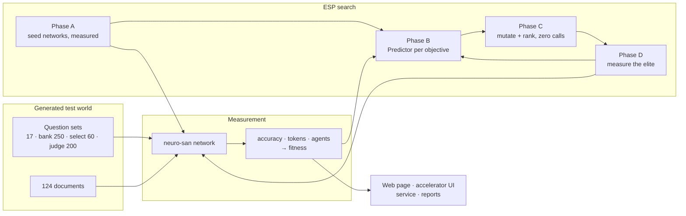

# neuro-san-esp

**A fitness function for [neuro-san](https://github.com/cognizant-ai-lab/neuro-san) agent
networks, and an evolutionary search that uses it.**

[](https://github.com/Sivakumarraj/neuro-san-esp/actions/workflows/ci.yml)
[](pyproject.toml)
[](LICENSE)

neuro-san turns a sentence into a working multi-agent network: `agent_network_designer`
generates one, validates it and serves it. It generates **one**, and never measures it.
Nothing in neuro-san scores one network against another, so there is no way to say whether a
nine-agent topology beats a five-agent one for the same job, or which model each agent should
run.

This project supplies that missing half. It **measures** a network (accuracy, token cost and
size over a fixed set of questions) and **searches** for a better one, borrowing the
surrogate-assisted structure of **ESP** (Evolutionary Surrogate-assisted Prescription),
Cognizant AI Lab's method for optimisation where every real evaluation is expensive.

In the [ESP paper](https://arxiv.org/abs/2002.05368) the Prescriptor is itself a learned
model. **There is no learned Prescriptor here**: prescription is seven mutation operators
plus Pareto-front selection, and what is borrowed is the Predictor and the sample-efficiency
argument. In shape this is nearer to **LEAF** (*Evolutionary Neural AutoML for Deep
Learning*, GECCO 2019), which evolves architectures, with agents where LEAF had layers.

## Headline result

On questions it was never chosen on, a **two-agent network, with the stronger model on
the one agent that reads the documents, scored 94.5% against 84.0%** for the four-agent
network neuro-san's designer would build, using 37% fewer tokens but costing more.

| 100 judge questions × 2 repeats, search returns 10 documents | `2cc4`, Researcher on `gpt-5.4-mini` | Designer's shape, all `gpt-5.4-nano` |
| --- | --- | --- |
| Accuracy | **94.5%** (189/200; 91, then 98) | 84.0% (168/200; 82, then 86) |
| Tokens per question | **6,500** (−37%) | 10,306 |
| Cost per question | $0.00537 (+71%) | **$0.00314** |
| Cost per correct answer | $0.00568 (+52%) | **$0.00374** |
| Agents | **2** | 4 |

- **Significant.** Right more often on 17 questions against 2: sign test p = 0.0007.
- **Chosen on select, judged on judge.** Every change was decided on the 60
  `meridian-select` questions (`2cc4` with the stronger Researcher scored 57/60 there).
  The judge questions come from the other half of the company and were never used to
  choose. They are not fresh: J001 to J100 were also asked in the earlier runs below,
  because the judge half has no unused aggregate questions left to draw.
- **Not a pure structure result.** The winner promotes one agent to a model 3.7× dearer
  per token; the designer's shape was not measured with its specialists promoted, so how
  much of the gap is structure and how much is model is not separated.
- **The benchmark changed.** The search tool returned 3 documents in every earlier run.
  At 3, a question such as "how many incidents were caused by a mis-picked pallet" cannot
  be answered: the word is in 8 documents. With 10 (`ESP_SEARCH_RESULTS=10`), the
  designer's shape rose from 69% to 84% on the same questions. Numbers at 3 and at 10
  are never compared with each other.
- **Where `2cc4` came from.** It is the hand-written `flat_pair` seed with its Arithmetic
  agent removed by the `remove_agent` operator: one mutation, chosen by measurement on
  select. The Predictor was not used in any paid run.

Before the search fix, on all-`gpt-5.4-nano` networks and the same 100 judge questions,
`2cc4` scored 153/200 (76.5%) against the designer's 138/200 (69.0%) with 17% fewer
tokens (p = 0.052). On 100 questions of four kinds no network had been asked before
(P001 to P100: temporal, filtered, compare, unanswerable) it scored 77/100 against
68/100 (p = 0.108), but used 7% more tokens there.

Every measured chunk is committed in `results/headtohead/paid-2026-10/`, and
`scripts/select_and_judge.py` reproduces the networks, the search and the summary
([details](#reproducing-the-head-to-head)). `tests/test_select_and_judge.py` recomputes
every figure in this section from those logs.

## What is included

- **A measurement for any neuro-san network** on any question file you can check the
  answers to: `make measure`, a browser page, or an evaluator agent inside neuro-san.
- **The ESP loop**: a seed population measured for real, one Predictor per outcome
  objective, thousands of candidates ranked for free, and only the most promising paid for.
- **A generated test world**, Meridian Logistics: 24 depots, 40 contracts, 60 incidents in
  124 documents, invented so no model can answer from memory.
- **Held-out question sets**: `meridian-select` (60) to choose on and `meridian-judge-200` to
  judge on, from disjoint halves of the company, plus the original 17 and a 250-question bank.
- **Cost in dollars, beside tokens**, a per-question Predictor, a pool benchmark that
  rehearses for $0, and a capped head-to-head that resumes where it stopped.
- **A service, a browser front end and neuro-san's accelerator UI**, Docker images from a
  pinned lockfile, and a `make validate` gate.

About 15,700 lines of application code and 9,600 lines of tests (Python 3.12+).

## Architecture


```mermaid
flowchart LR
    subgraph World["Generated test world"]
        Docs["124 documents"]
        Q["Question sets<br/>17 · bank 250 · select 60 · judge 200"]
    end

    subgraph Search["ESP search"]
        Seeds["Phase A<br/>seed networks, measured"]
        Pred["Phase B<br/>Predictor per objective"]
        Breed["Phase C<br/>mutate + rank, zero calls"]
        Pay["Phase D<br/>measure the elite"]
        Seeds --> Pred --> Breed --> Pay --> Pred
    end

    subgraph Measure["Measurement"]
        Net["neuro-san network"] --> Score["accuracy · tokens · agents<br/>→ fitness"]
    end

    Q --> Net
    Docs --> Net
    Seeds --> Net
    Pay --> Net
    Score --> Pred

    Score --> Out["Web page · accelerator UI<br/>service · reports"]
```

Each candidate **is** a neuro-san `agent_network_definition` plus a per-agent model choice,
so every network the search produces runs as an ordinary neuro-san network. Fitness is
**derived** from measured or predicted outcomes by a fixed formula, never learned:

```text
fitness = accuracy − 0.06 · min(tokens / 600000, 1) − 0.02 · (agents / 9)
```

[docs/DESIGN.md](docs/DESIGN.md) explains every part: the genome, the seven operators, the
validity gate, what the Predictor is and is not, and the service.

## Quick start

Python 3.12+. Nothing in this section needs an account, a key, or a network.

```bash
python3.12 -m venv .venv && source .venv/bin/activate
pip install -e ".[dev]"

make validate    # lint, docs, HOCON validator, the full suite, an offline search
make offline     # phases B and C: breed and rank candidates, zero LLM calls
make holdout     # select on half the questions, judge on the other half
```

`make offline` trains the Predictor on the 12 committed measurements in
`tests/fixtures/cache/` and evolves against them.

### With a key

Runs on whichever provider's key is present in `.env` (`.env.example` lists them), chosen the
way neuro-san-studio chooses:

```bash
cp .env.example .env      # uncomment your provider's key line; .env is gitignored
make check-key            # asks the provider whether the key works
make smoke                # four questions to the champion, end to end
```

A search needs a measured population first. There are two ways to get one. **They are
alternatives, not steps; run one, not both.**

```bash
make baseline             # A: measure the three seed networks on your provider
```

```bash
python scripts/adopt_measurements.py   # B: adopt the committed Gemini measurements
```

> **If a run ever reports `acc=0.00 tok=0 (cached)`**, an earlier run wrote zeros before the
> key worked. `tok=0` means no model was called. `rm -rf .esp-cache` and run the preflight
> again.

[docs/GUIDE.md](docs/GUIDE.md) covers providers and models, the preflight, what a run costs,
the web page, the accelerator UI, and running the optimiser as a service.

## Results of the search on the 17 built-in questions

The first search ran on Gemini. **Twelve networks measured on real model calls, 17 questions
each**, all on `gemini-3.1-flash-lite`:

| | Accuracy | Tokens | Agents | Fitness |
| --- | --- | --- | --- | --- |
| `seed:designer_shaped` — the shape the designer produces | 0.8235 | 385,280 | 4 | 0.7761 |
| `seed:flat_pair` | 0.8235 | 316,074 | 3 | 0.7852 |
| `seed:solo` — one agent, one tool | 0.8235 | 377,716 | 1 | 0.7835 |
| `mut:reassign_model` — cheapest win | 0.8824 | 260,052 | 5 | 0.8453 |
| **`mut:reassign_model` — best measured** | **0.9412** | 359,600 | 5 | **0.8941** |

- **Seventeen questions cannot rank individual networks**, which is why the headline result
  is judged on held-out questions. Selecting on half and judging on the other half, the
  searched winner beats the designer's shape in 90% of 200 splits, but a random network
  from the population does so 85.5% of the time (`make holdout`). On 24 held-out bank
  questions the evolved network answered 21 against the designer's 23 (`make bank-report`).
- **That champion's gain was a stronger router model.** Re-measured on held-out questions
  it tied the designer at 2.2× the cost, so the search was re-run for structure instead.
- **The select set leaves room to rank.** The designer's shape scored 16 of 20 (80%) on its
  first 20 questions, against 96% on the bank.
- **The Predictor beats chance offline.** At nine measurements its rank correlation was
  **−0.333**; trained on nine of the twelve it picks the best of three unseen networks 62%
  of the time against 33% by chance (`make ablation`), level with a rule that picks the
  network with the most agents.

Every number above is recomputed from committed data by a test.
[docs/FINDINGS.md](docs/FINDINGS.md) has the full measurements and the failure analysis.

## Limitations

- **One task domain.** Held-out questions come from the same generated world, so what is
  measured is stability across questions, not transfer to a new domain.
- **One generation of search on the held-out run.** `2cc4` is the best of eight children of
  a hand-written seed, judged on 100 questions twice; a longer search and more repeats
  would tighten the accuracy gap's error.
- **The paid result does not test the Predictor.** Every child in the paid search was
  measured; none was ranked by the Predictor first. Offline it picks the best of three
  unseen networks 62% of the time, level with picking the one with the most agents.
- **Shape is not the whole network.** Two children of `flat` with the same shape, a
  Coordinator over one searching Researcher, scored 54 and 48 of 60 on select: the
  instructions differ. The Predictor sees only shape.
- **Three models measured.** The search on `gemini-3.1-flash-lite`, the head-to-heads on
  `gpt-5.4-nano`, with `gpt-5.4-mini` on one agent in the headline.
- **The web page and `make smoke` serve the 17-question champion** (`3bf9c00`), the
  network that tied the designer at 2.2× the cost on judge, not `2cc4`.
- **A tree-based Predictor cannot extrapolate** beyond the shapes it has seen, and twelve
  measured networks are too few to show that it helps the search. The pool benchmark is
  built to answer that.
- **Not novel as an idea.** AgentSquare (ICLR 2025) also uses a performance predictor to
  search agent designs. What is new here is doing it for neuro-san, which has no fitness
  function at all.

## Reproducing the head-to-head

Put your key in `.env` (gitignored):

```bash
OPENAI_API_KEY=sk-...your-key...
ESP_PROVIDER=openai
ESP_DEFAULT_MODEL=gpt-5.4-nano
ESP_MODEL_TIERS=gpt-5.4-nano,gpt-5.4-mini
ESP_PIN_MODELS=1          # a failing model stops the run instead of being swapped
```

```bash
python scripts/select_and_judge.py networks            # every network and its hash; $0
python scripts/select_and_judge.py mutants             # the search's 8 children of flat
python scripts/select_and_judge.py measure 2cc4 --suite judge --out runs/r1 --go &
python scripts/select_and_judge.py measure designer --suite judge --out runs/r1 --go
python scripts/select_and_judge.py summary results/headtohead/paid-2026-10
```

For the headline run add `ESP_SEARCH_RESULTS=10` to `.env`, and run the evolved network as
`measure 2cc4 --promote Researcher --suite judge --repeats 2`. `--suite judge-plus` asks
P001 to P100. Both networks run at the same time under a dollar cap, and a stopped run
resumes from its log.

| Stage | Measured | Outcome |
| --- | --- | --- |
| 1 | `make headtohead GO=1`: the designer against the Gemini champion | 68 / 100 each; the champion cost 2.2× per question |
| 2 | Six committed networks and the designer on select (four found by the Gemini search, two hand-written seeds); the best on judge × 2 | `flat` (the `flat_pair` seed): 77.5% against 67.5% (p = 0.011), equal tokens |
| 3 | One search generation from `flat` (8 children) on select; the best on judge × 2 | `2cc4`: 76.5% against 69.0% (p = 0.052), 17% fewer tokens |
| 6 | `2cc4` and the designer on P001 to P100, once | 77 against 68 (p = 0.108), 7% more tokens |
| 7 | Search fixed to 10 documents; three networks and `2cc4` with its Researcher promoted, on select | 57, 53, 52 and 48 of 60 |
| 8 | The best of stage 7 and the designer on judge × 2 | the headline: 94.5% against 84.0% (p = 0.0007) |

The designer scored 67 to 70 of 100 in every run at 3 documents, so about ±2 questions is
run-to-run noise. Stages 0 to 3 cost $5.18 for 1,888 question-runs; stages 6 to 8 cost
$3.11 more. [The paid runs explained](docs/neuro-san-esp-Paid-Runs.pdf) walks through
stages 0 to 3; it was written before stages 6 to 8 and before the logs were committed.

## Pool benchmark

One search per method is one sample of that method. The pool benchmark measures 120 networks
once on the select questions, compares search strategies over that pool in hundreds of free
replicate searches, tests each against a permutation null (Holm-adjusted), and judges the
winners on the judge questions.

The full run is 9,000 question-runs: about $123 to $251 if every agent ran
`claude-haiku-4-5`, $245 to $501 on `claude-sonnet-5`, and $39 to $81 on
`gemini-3.1-flash-lite`, at 9,741 to 19,892 tokens a question, the range committed runs
have cost. The rehearsal takes about 30 minutes on four cores.

```bash
make pool                # prints the plan and its price; spends nothing
make pool REHEARSE=1     # the whole run against a simulated provider, for $0
make pool GO=1           # measures and judges, and resumes from the cache if stopped
```

## Repository layout

| Path | What lives there |
| --- | --- |
| `esp/genome/` | The genome: neuro-san network definitions, the seven mutation operators, three seed networks |
| `esp/eval/` | The world, the question sets, the runner, the scorer, model failover |
| `esp/surrogate/` | The Predictor and its quality reporting |
| `esp/evolve/` | The ESP loop and the same-budget experiment |
| `esp/service/` | The loop as an interruptible service, and the evaluator's tools |
| `esp/measure.py` | Measure any neuro-san network on any question file |
| `esp/report/` | The PDFs and the figures |
| `apps/web/` | The browser front end: ask a network, measure networks |
| `apps/optimizer/` | One optimiser wake, runnable by hand or from any scheduler |
| `registries/` | neuro-san manifests for the optimiser and the evaluator |
| `scripts/` | Command-line entry points behind the make targets |
| `tests/` | The suite, and the committed measurements in `tests/fixtures/cache/` |
| `results/` | Run history, held-out bank reports and figures |

## Testing

```bash
make validate      # lint, docs, HOCON validator, the full suite, an offline search
make verify        # a real neuro-san server firing the optimiser on its schedule
make figures       # every Predictor figure, regenerated from committed data
make bank-report   # the held-out bank comparison, from committed reports
make cost-report   # every network in tokens and in dollars
make pool REHEARSE=1   # the paid run end to end against a simulated provider, $0
```

The suite re-derives every question's answer from the documents, checks the registries
against contract tests, runs the experiment end to end against a fake provider, and fails if
this README disagrees with the committed measurements. Transcripts of real runs are in
`docs/proofs/`.

## Documentation

| | |
| --- | --- |
| [docs/DESIGN.md](docs/DESIGN.md) | How the search works, part by part |
| [docs/GUIDE.md](docs/GUIDE.md) | Running it: providers, web page, accelerator UI, service |
| [docs/FINDINGS.md](docs/FINDINGS.md) | Measurements, failure analysis, prior art |
| [SERVING.md](SERVING.md) | Deployment, state, budget and the security model |
| [CONTRIBUTING.md](CONTRIBUTING.md) | Development setup and checks |
| [SECURITY.md](SECURITY.md) | Keys, the public page, dependencies, reporting a vulnerability |
| [Beginner's guide](docs/neuro-san-esp-Beginner-Guide.pdf) | How it runs, step by step, with real examples |
| [Dossier](docs/neuro-san-esp-Dossier.pdf) | The technical report, with captured evidence |
| [Primer](docs/neuro-san-esp-Primer.pdf) | The same project without the jargon |
| [Paid runs](docs/neuro-san-esp-Paid-Runs.pdf) | Paid stages 0 to 3, explained for a beginner |

The three PDFs above the last were written in September from the 17-question Gemini search.
Their "0.94 against 0.82" is a score on the questions the network was chosen on; on held-out
questions that network tied the designer. The headline above and
[docs/FINDINGS.md](docs/FINDINGS.md) supersede them.

Built on [neuro-san](https://github.com/cognizant-ai-lab/neuro-san) by Cognizant AI Lab.
Licensed under Apache 2.0.
